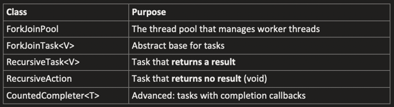

Fork/Join Framework, java 7+ designed for CPU bound **Divide and Conquer** parallel algorithms.
---
### Work-Stealing-Algorithm
The differentiator between a ThreadPoolExecutor and Fork-Join Pool is its `work-stealing-algorithm`.

### How it functions ?
1. **Thread-Local deque**: Every worker in pool maintain its own Double-Ended Queue(Deque) of tasks.
2. **LIFO for Owner**: When a worker thread generates new sub-tasks (using fork()), it pushes them onto the head of its own deque. When looking for work, it pops from the head (LIFO order). 
   This optimizes for cache locality because the most recently created sub-tasks are likely working on memory that is currently hot in the CPU cache.
3. **FIFO for Thieves**: If a worker thread empties its own deque, it doesn't just block. Instead, it randomly selects another worker thread and "steals" a task from the tail of that thread's deque (FIFO order). 
   This minimizes contention, as the owner is working on one end of the queue while the thief is stealing from the other.

### To implement Fork-Join algorithm, we should extend one of these classes.
1. `RecursiveAction`: For tasks that perform computation but do not return result(ex: modifying an array in place). 
2. `RecursiveTask<V>`: For tasks that compute and return result of type V (ex: parallel map-reduce)

### Core Architecture:

```
                        ┌──────────────────────────┐
                        │      ForkJoinPool        │
                        │  (Common Pool or Custom) │
                        └──────────┬───────────────┘
                                   │
              ┌────────────────────┼───────────────────┐
              │      LIFO          │      LIFO         │
     ┌────────▼───────┐  ┌──────── ▼──────┐  ┌────────▼───────┐
     │  Worker Thread │  │  Worker Thread │  │  Worker Thread │
     │  ┌──────────┐  │  │  ┌──────────┐  │  │  ┌──────────┐  │
     │  │  Deque   │  │  │  │  Deque   │  │  │  │  Deque   │  │
     │  │ (Tasks)  │  │  │  │ (Tasks)  │  │  │  │ (Tasks)  │  │
     │  └──────────┘  │  │  └──────────┘  │  │  └──────────┘  │
     └────────────────┘  └────────────────┘  └────────────────┘
              ▲                                        │
              │          Work Stealing(FIFO) ◄─────────┘
              └────────────────────────────────────────
```
Key classes:
```

```
### RecursiveTask - Parallel Sum

```java
import java.util.concurrent.RecursiveTask;

public class ParallelSum extends RecursiveTask<Long>{
    
    private static final int THRESHOLD = 10000;  
    private final long[] array;
    private final int start,end;
    
    public ParallelSum(long[] array, int start, int end) {
       this.array = array;
       this.start = start;
       this.end = end;
    }
    
    @Override
    protected long compute(){
       int length = end -start;
       
       // Base case - small enough to compute directly
       if(length <= THRESHOLD) return computeDirectly();
       
       // FORK : split into two halves
       int mid = start+length/2;
       ParallelSum leftTask  = new ParallelSum(array, start, mid);
       ParallelSum rightTask = new ParallelSum(array, mid, end);
       
       // Fork right task asynchronously (pushed to deque)
       rightTask.fork();
       
       // Compute leftTask in the current thread
       long leftResult = leftTask.compute();
       
       // JOIN - wait for right task result
       long rightResult = rightTask.join();
       
       return leftResult + rightResult ;
    }
    
   private long computeDirectly() {
      long sum = 0;
      for (int i = start; i < end; i++) sum += array[i];
      return sum;
   }

   public static void main(String[] args) {
      int size = 1_000_000;
      long[] data = new long[size];
      for (int i = 0; i < size; i++) data[i] = i + 1;

      // parallelism = CPU cores - 1
      ForkJoinPool pool = ForkJoinPool.commonPool();

      long result = pool.invoke(new ParallelSum(data, 0, size));
      System.out.println("Sum: " + result); // 500000500000
   }
    /**
     * Always fork() the second subtask and compute() (not join()) the first in the current thread. 
     * This avoids blocking the current worker unnecessarily and reduces thread context switching.
     */
}

```
### RecursiveAction - Parallel Array Initialization

```java
import java.util.Arrays;
import java.util.concurrent.ForkJoinPool;

public class ParallelFill extends RecursiveAction {

   private static final int THRESHOLD = 5000;
   private final int[] array;
   private final int start, end, value;

   public ParallelFill(int[] array, int start, int end, int value) {
      this.array = array;
      this.start = start;
      this.end = end;
      this.value = value;
   }

   @Override
   protected void compute() {
      if ((end - start) <= THRESHOLD) {
         Arrays.fill(array, start, end, value);
         return;
      }

      int mid = (start + end) / 2;
      invokeAll(  // forks both task and waits
              new ParallelFill(array, start, mid, value),
              new ParallelFill(array, mid, end, value)
      );
   }

   public static void main(String[] args) {
      int[] arr = new int[1_000_000];
      ForkJoinPool pool = new ForkJoinPool();
      
      pool.invoke(new ParallelFill(arr,0,arr.length,42));
      pool.shutdown();
      System.out.println(arr[999_999]); //42
   }
}

```
### Custom ForkJoinPool - Controlling Parallelism

```java
import java.util.concurrent.ForkJoinPool;

class CustomForkJoin {
   public static void main(String[] args) {

      ForkJoinPool commonPool = ForkJoinPool.commonPool();
      System.out.println(commonPool.getParallelism());  // for octa core CPU - 7 

      // custom pool - useful for isolation
      ForkJoinPool customPool = new ForkJoinPool(
              4,   // parallelism level
              ForkJoinPool.defaultForkJoinWorkerThreadFactory,
              null,   //UncaughtExceptionHandler
              false   // asyncMode
      );
      
      try{
          Long result = customPool.invoke(new ParallelSum(data, 0,data.legth()));
      }finally{
          customPool.shutdown();   
      }
   }
}

```
### Parallel Merge Sort
```java

```

### Fork-Join Pool and Parallel Stream
```java
class ParallelStreamForkJoin{
   public static void main(String[] args) {

// Parallel streams internally use ForkJoinPool.commonPool():
      List<Integer> result = IntStream.rangeClosed(1, 1_000_000)
              .parallel()
              .filter(n -> n % 2 == 0)
              .boxed()
              .collect(Collectors.toList());

// Run parallel stream on a CUSTOM pool
      ForkJoinPool myPool = new ForkJoinPool(2);
      myPool.submit(() ->
              IntStream.rangeClosed(1, 1_000_000)
                      .parallel()
                      .sum()
      ).get();
   }
}

```
### Summary 
```
ForkJoinPool  →  Work-stealing thread pool
RecursiveTask →  divide + conquer + return result
RecursiveAction → divide + conquer + no result
ManagedBlocker → safely block inside a FJ task
invokeAll()   →  cleanest way to fork multiple subtasks

```