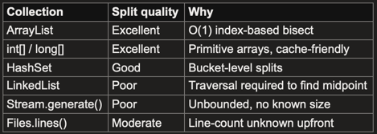

Parallel Streams 
---
### 1. How to parallel streams work internally ?

When we call `.parallelStream()` on a collection, internally Java does:
```
1. Wraps the collection's `Spliterator` in a parallel pipeline descriptor.
2. Submits the pipeline as a `ForkJoinTask` to the Common ForkJoinPool.
3. The pool uses `work-stealing` — each thread maintains a deque of tasks; idle threads steal from the tail of busier threads' deques.
4. Each thread processes independently, then results are combined (via the combiner in `reduce()` or the downstream collector in `collect()`).

NOTE: Parallel streams are best for `CPU-bound, stateless, non-ordered` operations on `large in-memory collections`. 
They are a poor fit for IO-bound work or small datasets.
```
### 2. Basic Syntax
```java
class ParallelStreamConcepts{
    public static void main(String[] args) {

        // Example of transactions schema validation and duplicate detection
        List<PaymentResult> results = payments.parallelStream()
                .filter(Payment::isValid)
                .map(engine::process)
                .collect(Collectors.toList());
        
        // We can convert mid-stream
        List<PaymentResult> results = payments.stream()
                .parallel()
                .filter(Payment::isValid)
                .sequential()  // switch back if one must be serial
                .sorted()
                .collect(Collectors.toList());
        
    }
}
```
### 3. Spliterator - data splitting


```java
import java.math.BigDecimal;
import java.util.ArrayList;
import java.util.stream.Collectors;

class ParallelStreamsConcepts {
    public static void main(String[] args) {
        
        // Even though source is LinkedList from a queue, force ArrayList for good splitting
        List<Transaction> batch = new ArrayList<>(inboundQueue.fetchAll());
        
        Map<String, BigDecimal> fxExposure = batch.parallelStream()
                .filter(tx -> tx.getCurrency() != Currency.INR)
                .collect(Collectors.groupingByConcurrent(
                        tx -> tx.getCurrency().getCode(),
                        Collectors.reducing(BigDecimal.ZERO,Transaction::getAmount,
                                BigDecimal::add)
                ));
    }
}
```
### 4. Thread safety - critical concern
Multiple threads operating on shared mutable state causes data corruption, `ConcurrentModificationException`
or lost updates.
NOTE: Never mutate shared state in  Parallel stream lambdas.

```java
import java.util.ArrayList;

class ParallelThreadSafety {
    public static void main(String[] args) {
        
        // Wrong - data loss or ConcurrentModificationException
        List<Payment> flagged = new ArrayList<>();
        payments.parallelStream()
                .forEach(p ->{
                        if(fraudEngine.isSuspicious(p)){
                            flagged.add(p);  // ArrayList is not Thread safe
                        }
                    }    
                );
        // Correct - use collect() with thread safe collector
        List<Payment> flagged = payments.parallelStream()
                .filter(fraudEngine::isSuspicious)
                .collect(Collectors.toList()); 
        
        // Correct - use ConcurrentHashMap to get into a map object
        ConcurrentHashMap<String, Long> txnCountByMerchant = new ConcurrentHashMap<>();
        payment.parallelStream()
                .forEach(p -> txnCountByMerchant.merge(p.getMerchantId(), 1L, Long::sum));
    }
}
```
### Terminal Operation
a. `collect()`
```java
// 1. Group payments by currency
Map<String, List<Payment>> byCurrency = payments.parallelStream()
    .collect(Collectors.groupingByConcurrent(Payment::getCurrencyCode));

// 2. Sum amount per currency
Map<String, BigDecimal> totalByCurrency = payments.parallelStream()
    .collect(Collectors.groupingByConcurrent(
        Payment::getCurrencyCode,
        Collectors.reducing(BigDecimal.ZERO, Payment::getAmount, BigDecimal::add)
        ));

// 3. Partition into high-value vs normal
Map<Boolean, List<Payment>> partitioned = payments.parallelStream()
    .collect(Collectors.partitioningBy(
    p -> p.getAmount().compareTo(new BigDecimal("100000")) > 0
));

// 4. Statistics — min, max, avg amount in one pass
DoubleSummaryStatistics stats = payments.parallelStream()
    .collect(Collectors.summarizingDouble(p -> p.getAmount().doubleValue()));
```
b. `reduce()`
```java
// Only safe for sequential; parallel gives wrong results
BigDecimal total = payments.stream()
    .map(Payment::getAmount)
    .reduce(BigDecimal.ZERO, BigDecimal::add);

// CORRECT — explicit 3-arg form for parallel safety with custom types
BigDecimal netFlow = trades.parallelStream()
    .reduce(
    BigDecimal.ZERO,                    // identity
    (acc, t) -> acc.add(               // accumulator
    t.getSide() == BUY ? t.getNotional() : t.getNotional().negate()),
    BigDecimal::add                     // combiner: merges two partial sums
);

```
c. `forEach()` and `forEachOrdered()`
```java
// forEach — threads write in any order
payments.parallelStream()
    .forEach(p -> auditLogger.log(p.getId(), p.getStatus())); // order doesn't matter

// forEachOrdered — enforces source order — Avoid on large datasets
 payments.parallelStream()
        .forEachOrdered(p -> orderedFile.write(p));

// If we need ordered output, collect() then iterate
List<Payment> sorted = payments.parallelStream()
    .filter(Payment::isApproved)
    .sorted(Comparator.comparing(Payment::getTimestamp))
    .collect(Collectors.toList());
sorted.forEach(orderedFile::write); // sequential write after parallel processing

```